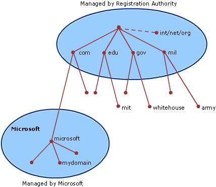
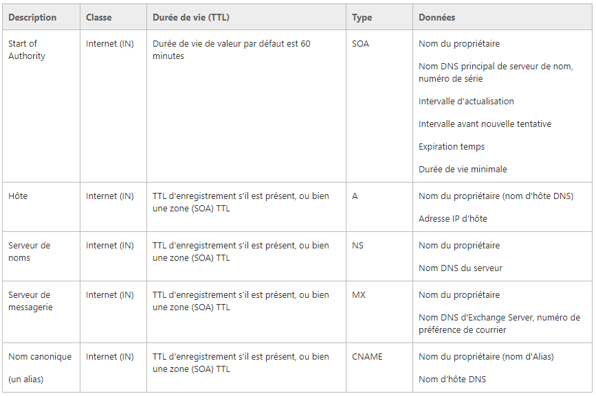

**Accès web (DNS, HTTP)**
--------------------------
##Team
   * Animateur : **Hugo**
   * Secrétaire : **Emilien**
   * Scribe : **Nico**
   * Gestionnaire : **Max**

## Mots Clés
   * DNS : domain name system : service permettant de traduire un nom de domaine en information y étant associées, notamment l’IP (ou IP vers nom de domaine)
   * Apache : serveur http libre, serveur le plus populaire sur le world wide web
   * HTTP : hypertext transfer protocol, protocole de la couche application utilisant TCP, par défaut port 80
   * Hypertext : document ou ensemble de documens contenant des unités d’information liées entre elles par des hyperliens
   * Hyperliens : lien web, référence permettant de passer d’un document à un autre
   * Nslookup : outil de troublshooting DNS
   * FAI
   * FQDN : fully qualified domain name : url complet ex. www.cesi.fr
   * nginix : serveur web opensource
   * iis : serveur web opensource dev par microsoft
   * registrar : métier : vente de noms de domaines 
   * Virtual Host : méthode pour host plusieurs noms de domaine sur un même serveur physique
   * enregistrement DNS de type A : on donne un FQDN et on récup un ip
   * résolution de nom
   * adresse IP 8.8.8.8 : serveur DNS publique de google
    

## Contexte

### Quoi ?
 *  Panne/Réparer du serveur DNS du FAI
 * Rétablir l'accès au site
 * Rétablir le serveur DNS
  
### Comment ?
  * En réparant le problème avec le DNS
  
### Pourquoi ?
* Pour pouvoir accéder à [lemonde.fr](lemonde.fr)

## Contraintes
   * aucune

## Problématique
   * Comment faire en sorte que notre FAI reconnaisse notre DNS

## Généralisation
   * MCO : maintenance en condition opérationnelle

## Hypothèses
 * 8.8.8.8 est l'adresse du DNS de google
 * nslookup donne le domaine dans lequel on est et nous donne l'adresse IP correspondante
 * Apache et IIS sont des paquets qui permettent de construire un serveur
 * On ne peut demander au FAI de mettre à jour un DNS nous correspondant
 * OVH donne les noms de domaines
   
## Plan d'action

### Études
#### **DNS**
 
Rôle : paire un nom de domaine à une adresse IP 

Avant DNS la résolution de nom se faisait à l’ide d’un fichier texte appelé HOST.TXT maintenu par le NIC (network information center) du Stanford Research Institut

Le DNS (Domain Name System) est un service qui permet d'effectuer la résolution de noms, c'est à dire d'associer une adresse IP à un FQDN (Full Qualified Domain Name) et inversement.

Un FQDN est composé ‘un nom d’hôte et d’un nom de domaine, exemple : www.google.com est un FQN où www est le nom d’hôte et google.com est le nom de domaine.

Les noms de domaine sont organisés de manière hiérarchique le domaine se trouvant le plus haut dans la hiérarchie est « . » il est omispar le FQDN on trouve en dessous dans la hiérarchie les TLD.

Ce nom a la structure ww.xx.yy.zz soit une suite d'éléments séparés par des points. Chaque élément est fait des lettres de l'alphabet, chiffres et/ou trait d'union, et ne peut excéder 63 caractères. L'ensemble d'un FQDN ne peut excéder 255 caractères.

Domaine de premier niveau (TLD): sous domaine de la racine, est le dernier label du nom de domaine ( .com, .org, .fr) il devrait être suivi d’un point mas on l’omet dans l’usage courrant
Il existe approximativement 560 domaines de premier niveau
260 nationaux
300 génériques 

**Hiérarchie du DNS :**

 
Le système DNS est une hiérarchie donc le sommet est la racine représentée par un point
On peut créer un ou plusieurs sous-domaines dans un domaine et une délégations de ceux-ci ( indication que les info relatives à ce sous-domaine sont enregistrées sur un autre serveur, tous les sous-domaines ne sont pas nécessairement délégués
Les délégations créent des zones : ensembles de domaines et leurs sous-domaines non délégués
Les domaines sous la racines sont appelés Top Level Domains(TLD) si ils correspondent à un pays ils sont appelés ccTLC (country cocde TLD) sinon génériques (gTLD)
Ensuite viennent les domaines de second niveau qui appartiennent à des individus ou organisation (ex : « wikipedia.fr », « cesi.fr »)
Ensuite viennent les sous domaines (exemple.site.com)
On peut avoir en fin d’arborescence un nom d’hôte 

**Résolution de noms directe**
Dans un réseau IP, lorsqu’une machine A veut communiquer avec une machine B, la machine A connaît le nom FQDN de B.
Par exemple, lorsqu’on navigue sur le net, on connaît en général le nom FQDN des serveurs qu’on visite (exemple www.microsoft.fr.).
Pour que A puisse communiquer avec B grâce au protocole IP, A va avoir besoin de connaître l’adresse IP de B.
A doit posséder un moyen d’effectuer la résolution de noms directe, c’est-à-dire un moyen de trouver l’adresse IP de B à partir de son nom qualifié.
Le résolveur est le programme chargé de cette opération.

**Résolution de noms inverse**
La machine B reçoit un datagramme IP en provenance de A. Ce datagramme contient l’adresse IP de A. B peut avoir besoin de connaître le nom FQDN de la machine A.
B doit donc être capable de trouver le nom FQDN de A à partir de son adresse IP. C’est ce qu’on appelle la résolution de noms inverse.
Le résolveur est également chargé de cette opération.

**Résolution de nom par serveur DNS (Domain Name System)**
On installe un serveur de noms sur le réseau. Chaque machine du réseau doit connaître l’adresse IP de ce serveur DNS. Dès qu’une machine veut effectuer une résolution de noms directe ou inverse, elle va interroger le serveur de noms. L’administrateur doit configurer le serveur de noms pour que ce dernier connaisse l’adresse IP et le nom de toutes les machines du réseau.

Une bdd dns se compose d’enregistrements de ressource

**Types d’enregistrements :**

A ou adresse fait correspondre un nom d’hôte, de domaine ou sous-domaine en ipv4
CNAME : canonical name record permet de faire un alias vers un autre domaine
MX : mail exchange définit les serveurs courriel 
PTR : pointer record associe un IP à un nom de domaine on l’appelle également reverse puisqu’il fait l’inverse d’un enregistrement A
NS : name server défini les serveurs DNS de ce domaine
SOA start of authority : info générales : serveur principal, courriel de contact, TTL, n°de série de la zone (version de la zone
NAPTR name authority Pointer record : donne accès à des règles de réécriture de l’information ( ?)
TXT permet à l’admin d’inserer un texte quelconque dans un enregistrement DNS

Zone : une zone est une partie de la bdd DNS qui contient les enregistrements de ressources avec les noms des propriétaire qui appartient à la partie contiguë de l’espace nom DNS, un serveur DNS peut être configuré pour avoir 0,1 ou plusieurs zones
Chaque zone est ancrée a un domaine spécifique appelé domaine racide de la zone et contient les info sur tous les noms se qui se terminent par le nom racine
(du coup si le domaine racine est wikipedia. la zone contient fr.wikipedia. , en.wikipedia.  etc ?)

####**Protocole http**

Liste des serveurs http :

•	C : Apache, Zeus Web Server, nginx, lighttpd, Cherokee, Hiawatha Webserver
•	ASP/ASP.Net(C#, VB.net) : IIS
•	Java : Tomcat, Jetty, GlassFish, JBoss, JOnAS, Vert.x
•	Python : Zope
•	Pike : Caudium
•	Ruby : WEBrick, Mongrel, Thin
•	Erlang : Yaws
•	Javascript : Node.js

Hypertext transfer protocol : protocole de communication client-serveur dévelopé pour le world wide web

Structure d’une requête :

•	Première ligne
•	verbe
•	identifiant local de la ressource
•	version du protocole HTTP
•	En-têtes (suivis d’une ligne vide)
•	Contenu facultatif (selon le verbe)

Structure d’une réponse :

•	Première ligne
•	version du protocole HTTP
•	code de statut
•	libellé textuel
•	En-têtes (suivis d’une ligne vide)
•	Contenu facultatif (selon le code de statut)

####**Fonctionnement de nslookup**

Nslookup est un outil de troublshooting (c’est donc un programme, et non pas une commande sur windows en tout cas) sur linux on préferera utiliser dig car nslookup est deprecated

* ? montre tt les commandes
* Exit pour quitter
* Quand on le démarre il montre le nom d’hôte et l’IP du serveur DNS configuré pour le système local
* Pour avoir l’ip d’un hôte on peut simplement taper son nom, il nous fournit l’ip, le nom du serveur
* Par défaut nslookup utilise le dns de l’hôte mais on peut focus un autre dns à l’aide de server < name> avec < name> le nom de la machine

####**Organismes gérant les protocoles **

IANA internet assigned number authority qui est un département de l’ICANN

####**Théorie de communication**
Apparue en même temps que la théorie de l’information, son but est de formaliser et modéliser la relation homme-machine 
Il y a communication lorsqu’on émet ou reçoit un message et qu’on donne une signification au message, ce qui permet de les comprendre

  * Format des messages (émission/réception)
Simplex : de l’un vers l’autre rien d’autre (radio)
Half duplex : dans les 2 sens mais pas en même temps (walkie-talkie)
Full-Duplex : 2 sens en même temps
 
  * Messages
Messages dns ?
Requêtes 
Réponses
Mise à jour

 
En-tête DNS : 
Id de transcription : 16 bits qui identifient une transaction dns spécifique, créé par l expéditeur et copié par le répondeur dans le message de réponse, le client DNS
Demande/réponse : flag de 1b, 0 pour une demande 1 pour une réponse
Code d’opération : 4 bits représentant l’opération de service de nom du paquet
Réponse faisant autorité : flag
Troncature : flag 1 si le nombre total de réponses dépasse le datagrame UDP, sauf si les datagrames UDP > 512 octets ou EDNS0 est activé
Récursivité souhaitée : flag 1 récusif, 0 non récursif, si le serveur DNS reçoit un message avec ce flag a 0 il retourne une liste d’autre serveurs DNS que le client peut contacter
Récursivité disponible : flag 1 = le serveur peut traiter les requêtes récursives
Réservé : 3bis réservés à 0
Code de retour : 4its de code d’erreur, par exemple :0 = réponse correcte,  3 erreur nom non existant
Nb d’enregistrements de ressource de question : 16bits représentant le nb d’entrées dans la section question
Nb d’enregistrement de ressource réponse : 16bits nb d’entrée dans la section réponse
Nb d’enregistrement de ressource autorité : 16bits
Nb d’enregistrement de ressources supplémentaire : 16bits

Question de requête DNS :
Nom de la question : nom de domaine interrogé
Représenté 

  * Canaux de communication
    * Media de transmission de l’information
    * Cuivres
    * Fibre optique
    * Ondes électromagnétiques
  
####**Couches des différents protocoles**
 

####**Implémentation des protocoles**
 
Implémentation d’http : 

En http une méthode est une commande spécifiant un type de requête, elle demande au serveur d’effectuer une action 
Il existe de nombreuses méthodes, les plus courantes étant GET, HEAD et POST :

GET
C'est la méthode la plus courante pour demander une ressource. Une requête GET est sans effet sur la ressource, il doit être possible de répéter la requête sans effet.

HEAD
Cette méthode ne demande que des informations sur la ressource, sans demander la ressource elle-même.

POST
Cette méthode est utilisée pour transmettre des données en vue d'un traitement à une ressource (le plus souvent depuis un formulaire HTML). L'URI fourni est l'URI d'une ressource à laquelle s'appliqueront les données envoyées. Le résultat peut être la création de nouvelles ressources ou la modification de ressources existantes. À cause de la mauvaise implémentation des méthodes HTTP (pour Ajax) par certains navigateurs (et la norme HTML qui ne supporte que les méthodes GET et POST pour les formulaires), cette méthode est souvent utilisée en remplacement de la requête PUT, qui devrait être utilisée pour la mise à jour de ressources.

OPTIONS
Cette méthode permet d'obtenir les options de communication d'une ressource ou du serveur en général.

CONNECT
Cette méthode permet d'utiliser un proxy comme un tunnel de communication.

TRACE
Cette méthode demande au serveur de retourner ce qu'il a reçu, dans le but de tester et effectuer un diagnostic sur la connexion.

PUT
Cette méthode permet de remplacer ou d'ajouter une ressource sur le serveur. L'URI fourni est celui de la ressource en question.

PATCH
Cette méthode permet, contrairement à PUT, de faire une modification partielle d'une ressource.

DELETE
Cette méthode permet de supprimer une ressource du serveur.
Ces 3 dernières méthodes nécessitent généralement un accès privilégié.

  
###Réalistions
####**Résoudre le problème**
####**Connaitre "les 13"**

Un serveur racine du DNS est un serveur DNS qui réponds aux requêtes qui concernent les noms de domaines de premier niveau TLD) et les redirige vers le serveur DNS de premier niveau concerné (ils sont le '.' au dessus des TLD dans la hiérarchie)

Ils sont gérés sous l’autorité de l’ICANN et sont au nombre de 13

 

###**Workshop**

1) QUE CONTIENT VOTRE FICHIER /ETC/HOSTS ?

127.0.0.1       localhost
127.0.1.1       moi-LAMP

\# The following lines are desirable for IPv6 capable hosts
::1     localhost ip6-localhost ip6-loopback
ff02::1 ip6-allnodes
ff02::2 ip6-allrouters

2) DANS QUEL ORDRE SE FERA LA RESOLUTION DE NOMS SUR VOTRE MACHINE ? 
Nano /etc/host.conf
Multi on
Mais je ne sais pas ce que ça veut dire

3) QUELLE EST L'ADRESSE IP DU SERVEUR DE NOMS DNS QUE LE RESOLVEUR INTERROGERA ? 

DANS /etc/resolv.conf

domain localdomain
search localdomain
nameserver 192.168.157.2

4) MODIFIER LE FICHIER DE CONFIGURATION DE LA RESOLUTION DE NOMS POUR QU'IL INTERROGE LES SERVEURS DNS SUIVANTS :
Serveurs OpenDNS :
DNS Primaire : 208.67.222.222 
DNS Secondaire : 208.67.220.220

On édite /etc/resolv.conf

domain localdomain
search localdomain
nameserver 208.67.222.222
nameserver 208.67.220.220

1) DETERMINER L’ADRESSE IP DE WWW.CESI.FR 

; <<>> DiG 9.9.5-9+deb8u14-Debian <<>> www.cesi.fr
;; global options: +cmd
;; Got answer:
;; ->>HEADER<<- opcode: QUERY, status: NOERROR, id: 48249
;; flags: qr rd ra; QUERY: 1, ANSWER: 1, AUTHORITY: 0, ADDITIONAL: 1

;; OPT PSEUDOSECTION:
; EDNS: version: 0, flags:; MBZ: 0005 , udp: 4000
;; QUESTION SECTION:
;www.cesi.fr.                   IN      A

;; ANSWER SECTION:
www.cesi.fr.            5       IN      A       194.2.77.162

;; Query time: 20 msec
;; SERVER: 192.168.157.2#53(192.168.157.2)
;; WHEN: Wed Dec 06 09:33:07 CET 2017
;; MSG SIZE  rcvd: 56

IP de www.cesi.fr : 194.2.77.162
Qu’on trouve dans le dig ou avec ‘host cesi.fr’ 

2) DETERMINEZ SI LA REPONSE DU SERVEUR DNS QUI VOUS A REPONDU SUPPORTE LA RECURSIVITE ET SI SA REPONSE FAIT AUTORITE (« AUTHORITATIVE »). 
Les hôtes n’ont qu’une connaissance limitée du système des noms de domaine. Quand ils doivent résoudre un nom, ils s’adressent à un ou plusieurs serveurs de noms dit récursifs, ils vont parcourir la hiérarchie DNS et faire suivre la requête à plusieurs serveurs de nom pour fournir une réponse

Les flags sont rq rd et ra  QUERY: 1, ANSWER: 1, AUTHORITY: 0, ADDITIONAL: 1
Il supporte donc la récursivité (ra) mais la réponse n’est pas « authoritative » (pas de aa)

3) DETERMINEZ LE SERVEUR A UTILISER POUR OBTENIR UNE REPONSE «AUTHORITATIVE ». CE SERVEUR SUPPORTE-T-IL LA RECURSIVITE ? 

dig -t aaaa www.cesi.fr
;; AUTHORITY SECTION:
cesi.fr.                5       IN      SOA     ns.net4all-dns.com. ns2.net4all-dns.com. 2017120501 10800 3600 2592000 3600

il possède le flag ra, donc il supporte la récursivité

4) QUELLE REPONSE VOUS DONNE UN SERVEUR DNS LORSQU’IL NE SUPPORTE PAS LA RECURSIVITE ET QU’IL NE CONNAIT PAS LA REPONSE A VOTRE QUESTION ?

Je ne sais pas j’ai un connexion timeout

FONCTIONNEMENT DU DNS 
1) VISUALISEZ, AVEC L’OPTION +TRACE LA SUITE DES SERVEURS CONTACTES POUR TROUVER L’ADRESSE IP DE WWW.CESI.FR. QUELS SONT LES DOMAINES TRAVERSES ET LES SERVEURS DE NOMS INTERROGES ? LA REQUETE EST-ELLE RECURSIVE ? QUE CONSTATEZVOUS EN LANÇANT PLUSIEURS FOIS CETTE COMMANDE ? 

Il traverse tous les serveurs racines (a.root-serveurs.net. à m)
La requête est récursive car elle passe par plusieurs dns ?
Elle ne passe pas par les serveurs racines dans le même ordre

2) COMMENT SAVOIR QUELS SERVEURS DNS GERENT LE TLD .FR ? 
;; ANSWER SECTION:
fr.                     5       IN      NS      d.ext.nic.fr.
fr.                     5       IN      NS      d.nic.fr.
fr.                     5       IN      NS      e.ext.nic.fr.
fr.                     5       IN      NS      f.ext.nic.fr.
fr.                     5       IN      NS      g.ext.nic.fr.

;; ADDITIONAL SECTION:
d.ext.nic.fr.           5       IN      A       192.5.4.2
d.ext.nic.fr.           5       IN      AAAA    2001:500:2e::2
d.nic.fr.               5       IN      A       194.0.9.1
d.nic.fr.               5       IN      AAAA    2001:678:c::1
e.ext.nic.fr.           5       IN      A       193.176.144.22
e.ext.nic.fr.           5       IN      AAAA    2a00:d78:0:102:193:176:144:22
f.ext.nic.fr.           5       IN      AAAA    2001:67c:1010:11::53
g.ext.nic.fr.           5       IN      A       194.0.36.1
g.ext.nic.fr.           5       IN      AAAA    2001:678:4c::1

3) COMMENT RECUPERER AVEC DIG LES INFORMATIONS CONTENUES DANS LES ENTREES DE TYPE SOA DU DNS GERANT LA ZONE CESI.FR ?

Les enregistrements SOA (Start Of Authority) donnent les informations générales de la zone : serveur principal, courriel de contact, différentes durées dont celle d'expiration, numéro de série de la zone. Il désigne l'autorité (start of authority) ou le responsable de la zone dans la hiérarchie DNS. 
Cet enregistrement permet d'indiquer le serveur de nom maître (primaire), l'adresse email d'un contact technique (avec @ remplacé par un point) et des paramètres d'expiration. Ces paramètres sont dans l'ordre :
zone IN SOA primary email. ( serial refresh retry expire ttl )
avec: 
Zone : Nom de domaine associé à la zone. 

Primary : Nom de domaine du serveur primaire de la zone (notez le point apposé à la fin du nom). 

Email : C'est l'adresse électronique du contact technique de la zone. Cette adresse a un format particulier différent du format habituel utilisé pour le courrier électronique ; le "@" est en effet remplacé par un point ("."). Ainsi, pour une adresse "nom@nom_domaine", on obtient "nom.nom_domaine." (Notez encore une fois le point (".") à la fin du nom de domaine. Si le nom dans l'adresse email contient un point, celui-ci doit être "protégé" en le faisant précéder du caractère "\". Exemple : on notera philippe\.lubrano.nic.fr. pour philippe.lubrano@nic.fr 

Serial : Ce paramètre donne le numéro de série du fichier de zone, ce qui correspond à la version du fichier. Le serial est un entier de 32 bits qui doit être augmenté avant chaque enregistrement du fichier de zone après que des modifications y aient été effectuées. En principe, on peut choisir un numéro de série de départ quelconque et l'incrémenter à chaque modification du fichier de zone. Cependant, il y a un format recommandé, notamment : YYYYMMDDxx (YYYY : année ; MM : mois ; DD : jour ; xx : énième modification du jour). 

Refresh : Les serveurs secondaires autoritaires pour la zone procèdent régulièrement à la vérification du numéro de série du fichier de zone du primaire pour décider si la zone doit être transférée ou non. Le paramètre refresh donne l'intervalle de temps en secondes entre deux vérifications du numéro de série. La valeur recommandée est 86400 (c.-à-d. 24 heures) ; elle devra être réduite si les modifications sont fréquentes pour la zone. 

Retry : La vérification du numéro de série par un serveur secondaire peut se solder par un échec dû par exemple à des problèmes de connexion. Dans ce cas, la valeur du paramètre retry donne l'intervalle en secondes entre deux tentatives de lecture du serial du fichier de zone. La valeur recommandée est 21400, soit 6 heures ; elle devra être ajustée en fonction de la connectivité entre les serveurs autoritaires de la zone.

Expire : Un serveur peut ne pas réussir à vérifier le serial ou à transférer le fichier de zone. Dans ce cas, on considère au bout d'un certain temps que les informations qu'il détient dans la copie du fichier de zone sont "périmées" et qu'il ne faut plus les diffuser. Le paramètre expire donne le temps maximum pendant lequel les données du serveur secondaire peuvent être diffusées, si aucune vérification ni transfert de zone n'ont pu être effectués depuis leur téléchargement. La valeur recommandée pour expire est 3600000, soit 41 jours ; au-delà de cette période, le serveur ne diffusera plus ces données et répondra d'une manière non autoritaire pour les requêtes concernant cette zone. En général, on choisit une valeur de expire très grande par rapport à celle de refresh, et celle de refresh très grande par rapport à celle de retry (retry << refresh << expire).

TTL : Cette durée de vie (TTL : time to live) est différente de celle définie par $TTL (durée de vie des RR). Ce paramètre définit la durée de vie pour le "negative caching", c'est-à-dire le temps qu'une réponse négative doit rester dans les caches. Il existe deux types de réponse négative qu'un serveur peut renvoyer en réponse à une requête DNS (voir aussi RFC 2308)

Dig -t aaaa cesi.fr

4) DETERMINER LE TTL (DUREE PENDANT LAQUELLE L’ENREGISTREMENT SERA VALIDE DANS LES CACHES DES DNS) DE WWW.CESI.FR?
 
5, unité ? aucune idée : cycles?

5) LE TYPE NOM CANONIQUE (ALIAS). VERIFIER LE TYPE DE WWW.YAHOO.FR? 

6) TROUVER L’ADRESSE IP ET LE NOM DU SERVEUR D’ECHANGE DE COURRIER DE CESI.FR ?

