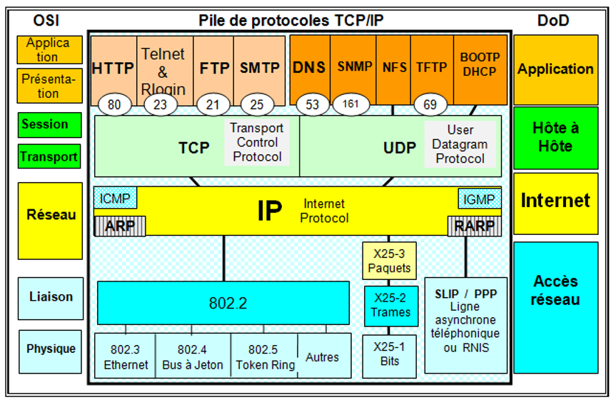
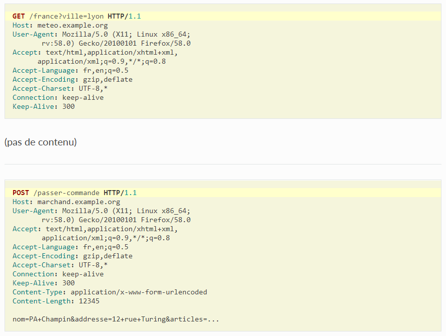
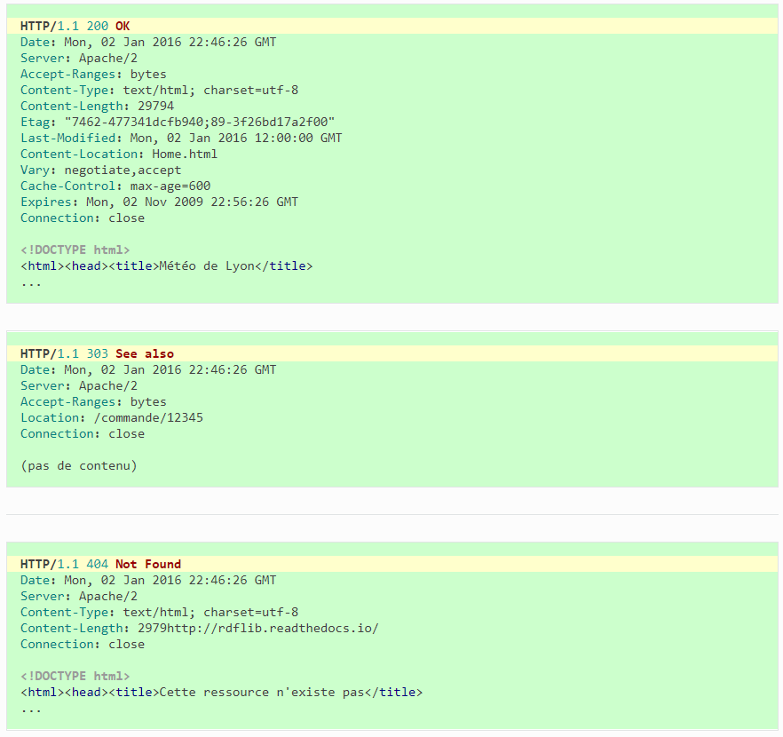
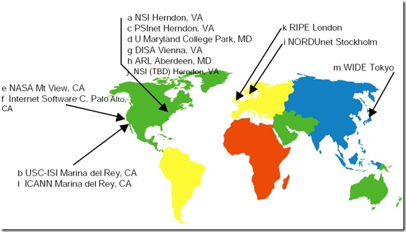

**Accès web (DNS, HTTP)**
--------------------------

##Team
   * Animateur : **Hugo**
   * Secrétaire : **Emilien**
   * Scribe : **Nico**
   * Gestionnaire : **Max**

## Mots Clés
   * DNS : Domain Name System
   * Appache : Serveur HTTP le plus répandu sur Internet
   * HTTP : Hyper Text Transfer Protocol, protocole de communication Client-Serveur développé pour le Web, il utilise le port 80 par défaut
   * Nslookup : Commande permettant de diagnostiquer l'infrastructure du système de nom de domaine (DNS)
   * FAI : Fournisseur d'accès Internet
   * FQDN : Nom de domaine révélant la position absolue d'un nœud dans une arborescence DNS en indiquant tous les domaines de niveau supérieur jusqu'à la racine. Par convention, le FQDN est ponctué par un point final. (ex : commons.wikimedia.org.)
   * nginix, appache, iis : Nginx est un logiciel libre de serveur Web, Apache est le serveur HTTP le plus répandu sur Internet, IIS (prononcé 2 I S) est un serveur Web (FTP, SMTP, HTTP, etc.) des différents systèmes d'exploitation Windows NT.
   * registrar : Bureau d'enregistrement, société ou association gérant la réservation de noms de domaine Internet
   * Virtual Host : 
   * enregistrement DNS de type A
   * résolution de nom : Fait souvent référence au DNS
   * adresse IP 8.8.8.8 : Adresse DNS de google
    

## Contexte

### Quoi ?
 *  Panne/Réparer du serveur DNS du FAI
 * Rétablir l'accès au site
 * Rétablir le serveur DNS
  
### Comment ?
  * En réparant le problème avec le DNS
  
### Pourquoi ?
* Pour pouvoir accéder à [lemonde.fr](lemonde.fr)

## Contraintes
   * aucune

## Problématique
   * Comment faire en sorte que notre FAI reconnaisse notre DNS

## Généralisation
   * MCO : maintenance en condition opérationnelle

## Hypothèses
 * 8.8.8.8 est l'adresse du DNS de google
 * nslookup donne le domaine dans lequel on est et nous donne l'adresse IP correspondante
 * Appache et IIS sont des paquets qui permettent de construire un serveur
 * On ne peut demander au FAI de mettre à jour un DNS nous correspondant
 * OVH donne les noms de domaines
   
## Plan d'action

### Études
  * DNS
  A l'époque lorsque Internet était un petit réseau de l'US Department of Defense, les noms d'hôtes étaient gérés grâce à un fichier HOSTS sur un serveur central, téléchargeait ce fichier pour résoudre les noms d'hôtes.  
  Le nombre d'utilisateurs augmentant, DNS fut inventé et les noms d'hôtes résident dans une base de donnée réparti entre plusieurs serveurs réduisant la charge sur chacun.  
  Le DNS permet d'associer des noms de langage courant aux adresses numériques (194.153.205.26 = www.commentcamarche.net)  
  La corrélation entre les deux s'appelle résolution de noms de domaines  
  D'une adresse IP le DNS donne le nom du domaine (le FQDN) et inversement, à partir d'un nom de domaine, le DNS sait retrouver l'adresse IP  
  On dit que le serveur DNS d'un réseau a autorité sur ce réseau  

    * Hiérachie du DNS :
    Le sommet de la hiérarchie est appelé la **_racine_**, elle est représentée par un point '.'  
    Les domaines se trouvant juste en dessous de la racine sont appelés 'Domaines de premier niveau' (Top Level Domain). Si ces TLD correspondent à une extension de pays, on les appelle des ccTLD (country code TLD, comme fr, be ..). Si au contraire ils ne correspondent pas à des extensions de pays ce sont des gTLD (generic Top Level Domain, comme org, com ...)  
    Les noms de domaines sont représentés en indiquant chaque domaine successivement en les séparant par un point : **com.** = com est un TLD, sous-domaine de la racine. **google.com.** = google est un sous-domaine de com  
    Pour résoudre un nom de domaine on parcourt la hiérarchie des domaines de la droite vers la gauche

    * Résolution du nom de domaine par un hote :
    Les hotes n'ont que peu de connaissance du systeme de nom de domaine. lorsqu'ils doivent résoudre un nom ils s'adressent à un ou plusieurs serveurs de noms, dits *récursifs*, qui vont parcourir la hiérarchie DNS et faire suivre la requete jusqu'a obtenir une reponse. Ces serveurs récursifs sont mis à disposition par les FAI pour leurs clients et certains sont ouvert, celui de [Google](https://fr.wikipedia.org/wiki/Google_Public_DNS) ou [OpenDNS](https://fr.wikipedia.org/wiki/OpenDNS)  
    Lorsqu'un serveur recursif doit trouver l'adresse IP de fr.wikipedia.org., il demande aux 13 serveurs racines lequel peut lui répondre sur la zone *org*. Il en choisi un parmi ceux répondant et demande une reponse pour la zone *wikipedia.org*. C'est un de ces derniers qui pourra lui donner l'adresse IP de fr.wikipedia.org. S'il se trouve qu'un serveur ne répond pas, un autre serveur de la liste sera consulté.  
    Un nom de domaine peut utiliser plusieurs serveurs DNS. Généralement, les noms de domaines en utilisent au moins deux : un primaire et un secondaire mais peut y avoir plusieurs serveurs secondaires.  
    L'ensemble des serveurs primaires et secondaires font autorité pour un domaine, c'est-à-dire que la réponse ne fait pas appel à un autre serveur ou à un cache.  
    Cette architecture garantit au réseau Internet une certaine continuité dans la résolution des noms. Quand un serveur DNS tombe en panne, le bon fonctionnement de la résolution de nom n'est pas remis en cause dans la mesure où des serveurs secondaires sont disponibles.  
    

    * Résolution inverse :
    Pour trouver le nom de domaine associé à une adresse IP, on utilise un principe semblable. Dans un nom de domaine, la partie la plus générale est à droite : org dans fr.wikipedia.org, le mécanisme de résolution parcourt donc le nom de domaine de droite à gauche. Dans une adresse IPv4, c'est le contraire : 213 est la partie la plus générale de 213.228.0.42. Pour conserver une logique, on inverse l'ordre des quatre termes de l'adresse et on la concatène au pseudo domaine in-addr.arpa. Ainsi, par exemple, pour trouver le nom de domaine de l'adresse IP 91.198.174.2, on résout 2.174.198.91.in-addr.arpa.  
    La déclaration inverse est importante sur les adresses IP publiques Internet puisque l'absence d'une résolution inverse est considérée comme une erreur opérationnelle qui peut entraîner le refus d'accès à un service. Par exemple, un serveur de messagerie électronique se présentant en envoi avec une adresse IP n'ayant pas de résolution inverse (PTR) a de grandes chances de se voir refuser, par l'hôte distant, la transmission du courrier (message de refus de type : IP lookup failed).  
    De plus, cette résolution inverse est importante dans le cadre de la réalisation de diagnostics réseaux car c'est elle qui permet de rendre les résultats de la commande traceroute humainement exploitables.  
    Les dénominations des noms d'hôtes inverses sont souvent des composites de sous-domaines de localisation (ville, région, pays) et de domaines explicites indiquant le fournisseur d'accès Internet traversé comme francetelecom.net (XXXX.nctou202.Toulouse.francetelecom.net) et opentransit.net (XXXX.Aubervilliers.opentransit.net) pour France Télécom, ou encore proxad.net (XXXX.intf.routers.proxad.net) pour Free.  
    Une adresse IP peut être associée à différents noms de domaine via l'enregistrement de plusieurs entrées PTR dans le sous-domaine .arpa dédié à cette adresse (in-addr.arpa. pour IPv4 et ip6.arpa. pour IPv6). L'utilisation d'enregistrements PTR multiples pour une même adresse IP est éventuellement présente dans le cadre de l'hébergement virtuel de multiples domaines web derrière la même adresse IP mais n'est pas recommandée dans la mesure où le nombre des champs PTR à renvoyer peut faire dépasser à la réponse la taille des paquets UDP de réponse et entraîner l'utilisation du protocole TCP (plus coûteux en ressources) pour envoyer la réponse à la requête DNS.  

  * Protocole HTTP
    * Structure d'une requete HTTP :
      * Première ligne : Verbe - identifiant local de la ressource - version du protocole HTTP
      * En-têtes (suivis d'une ligne vide)
      * Contenu facultatif (selon le verbe)

    * Structure d'une réponse HTTP :
      * Premier ligne : Version du protocole HTTP - code de statut - libellé textuel
      * En-têtes (suivis d'une ligne vide)
      * Contenu facultatif (selon le code de statut)

    * 

  * Fonctionnement de nslookup
   * nslookup + adresse.de.domaine  
   Renvoie l'adresse du serveur DNS repondant + le port correspondant  
   Renvoie l'adresse IP correspondant à l'adresse de domaine fournie
   * Fonctionne à la manière de la commande 'dig + adresse.de.domaine'

  * Organismes gérant les protocoles
   * L'IANA (*Internet Assignement Number Authority*) s'occupe de gérer les numéro de ports réservés, c'est un département de l'ICANN (*Internet Corporation for Assignement Names and Numbers*)

  * Théorie de la communication
   Apparue en même temps que la théorie de l’information, son but est de formaliser et modéliser la relation homme-machine 
   Il y a communication lorsqu’on émet ou reçoit un message et qu’on donne une signification au message, ce qui permet de les comprendre

  * Format des messages (émission/réception)
   * Simplex : Uniquement dans un sens, d'un expéditeur à un destinataire (Radio)
   * Half-Duplex : Communication dans les deux sens mais pas en même temps (Talkie - Walkie)
   * Full-Duplex : Communication dans les deux sens en même temps

  * Messages
   * Message requête au DNS
   * Requête du dns aux serveurs pour obtenir 
   * Réponse du dns à l'utilisateur
   En-tête DNS :  
   Id de transcription : 16 bits qui identifient une transaction dns spécifique, créé par l expéditeur et copié par le répondeur dans le message de réponse, le client DNS  
   Demande/réponse : flag de 1b, 0 pour une demande 1 pour une réponse  
   Code d’opération : 4 bits représentant l’opération de service de nom du paquet  
   Réponse faisant autorité : flag  
   Troncature : flag 1 si le nombre total de réponses dépasse le datagrame UDP, sauf si les datagrames UDP > 512 octets ou EDNS0 est activé  
   Récursivité souhaitée : flag 1 récusif, 0 non récursif, si le serveur DNS reçoit un message avec ce flag a 0 il retourne une liste d’autre serveurs DNS que le client peut contacter  
   Récursivité disponible : flag 1 = le serveur peut traiter les requêtes récursives  
   Réservé : 3bis réservés à 0  
   Code de retour : 4its de code d’erreur, par exemple :0 = réponse correcte,  3 erreur nom non existant  
   Nb d’enregistrements de ressource de question : 16bits représentant le nb d’entrées dans la section question  
   Nb d’enregistrement de ressource réponse : 16bits nb d’entrée dans la section réponse  
   Nb d’enregistrement de ressource autorité : 16bits  
   Nb d’enregistrement de ressources supplémentaire : 16bits  

   Question de requête DNS :
   Nom de la question : nom de domaine interrogé
   Représenté 

  * Canaux de communication
   * Media de transmission de l’information
   * Cuivres
   * Fibre optique
   * Ondes électromagnétiques

  * Couches des différents protocoles
  

  * Implémentation des protocoles
   * Formation d'un requête HTTP : 
    * Première Ligne :
     * Verbe
     * Identifiant Local de la Ressource
     * Version du protocole HTTP
    * En-têtes (suivi d'une ligne vide)
    * Contenu facultatif (selon le verbe)
    

   * Formation d'une réponse HTTP :
    * Première Ligne :
     * Version du protocole HTPP
     * Code de statut (d'erreur)
     * Libellé textuel
    * En-têtes (suivi d'une ligne vide)
    * Contenu facultatif (selon le code de statut)
    

   * Les différents Verbes :
   GET
   C'est la méthode la plus courante pour demander une ressource. Une requête GET est sans effet sur la ressource, il doit être possible de répéter la requête sans effet.

   HEAD
   Cette méthode ne demande que des informations sur la ressource, sans demander la ressource elle-même.

   POST
   Cette méthode est utilisée pour transmettre des données en vue d'un traitement à une ressource (le plus souvent depuis un formulaire HTML). L'URI fourni est l'URI d'une ressource à laquelle s'appliqueront les données envoyées. Le résultat peut être la création de nouvelles ressources ou la modification de ressources existantes. À cause de la mauvaise implémentation des méthodes HTTP (pour Ajax) par certains navigateurs (et la norme HTML qui ne supporte que les méthodes GET et POST pour les formulaires), cette méthode est souvent utilisée en remplacement de la requête PUT, qui devrait être utilisée pour la mise à jour de ressources.

   OPTIONS
   Cette méthode permet d'obtenir les options de communication d'une ressource ou du serveur en général.

   CONNECT
   Cette méthode permet d'utiliser un proxy comme un tunnel de communication.

   TRACE
   Cette méthode demande au serveur de retourner ce qu'il a reçu, dans le but de tester et effectuer un diagnostic sur la connexion.

   PUT
   Cette méthode permet de remplacer ou d'ajouter une ressource sur le serveur. L'URI fourni est celui de la ressource en question.

   PATCH
   Cette méthode permet, contrairement à PUT, de faire une modification partielle d'une ressource.

   DELETE
   Cette méthode permet de supprimer une ressource du serveur.  
   
   Ces 3 dernières méthodes nécessitent généralement un accès privilégié.

  * Résumé explications David
  Serveur : propose un service  
  Il faut démarrer le serveur pour qu'il commence à écouter  
  Apache, serveur WEB, Port 80  
  Apache ne sait pas utiliser PHP, il lui faut un mod  
  Page internet est stockée dans le serveur  
  Besoin de configurer apache avant de le httpd.conf  
  On déclare un VHost : Fait le pont entre, nom, port et fichier  
  Pour avoir plusieurs sites sur un même serveur, il faut donner plusieurs alias au même serveur  
  VirtualHost =   <VirtualHost ecommerce.fr : 80>  
      <VirtualHost toto.fr : 80>  
  http = protocol à utiliser  
  Requete GET = recupérer une resource sur le serveur  
  Une fois la liaison effectuée, le serveur dit à la machine de le contacter sur un autre port que le 80 pour ne pas le surcharger et communique avec cette machine depuis un autre port (ex : nouveau port d'écoute = 15202 ; nouveau port de communication = 25120)  
  Put = ajouter des ressources sur le serveur  
  Post = modifier des data présentes sur le serveur  
  Head = récupérer l'entete de la ressource  

  Code erreur http :  
  200 = Pas de soucis  
  500 -> + = Erreur Serveur  
  404 = erreur de ressource  
  100 = Information  
  300 = Redirection  

###Réalistions
  * Résoudre le problème 
  * Connaitre "les 13"
  Un serveur racine du DNS est un serveur DNS qui réponds aux requêtes qui concernent les noms de domaines de premier niveau TLD) et les redirige vers le serveur DNS de premier niveau concerné (ils sont le '.' au dessus des TLD dans la hiérarchie)
  Ils sont gérés sous l’autorité de l’ICANN et sont au nombre de 13

  