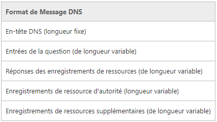

**Accès web (DNS, HTTP)**
--------------------------
#TO DO

* installer apache
* créer un virtual host 
* et des sites web
* dl postman
* faire des requêtes (éventuellement sur newbiecontest)
* rechercher les DNS secure

##Team
   * Animateur : **Max**
   * Secrétaire : **Emilien**
   * Scribe : **Nico**
   * Gestionnaire : **Hugo**

## Mots Clés
   * DNS : Domain Name Server 
   * Apache : Serveur HTTP créé et maintenu par la fondation Apache, c’est le plus populaire sur le World Wide Web.
   * http : Hypertext Transfer Protocol
   * Nslookup : Programme informatique de recherche d’information dans le DNS, qui associe le nom de domaine à une @IP. Il n’est plus utilisé pour UNIX, on utilise plus « dig » ou « host », cependant il est toujours d’actualisé sous Windows.
   * FAI : Fournisseur d’Accès Internet (Sfr, orange…)
   * FQDN : Fully Qualified Domain Name, dans le DNS, c’est un nom de domaine qui révèle la position absolue dans l’arborescence DNS en indiquant tous les domaines de niveau supérieur jusqu’à la racine. Par convention, un FQDN est terminé par un point. Ce qui signifie qu’il est suivie par une chaîne vide qui représente le domaine racine.
Par exemple : mymail.somecollege.edu
Le hostname est mymail, et il est dans le domaine, ‘somecollege.edu ‘, edu est le TLD (top level domain)
   * nginx ,  iis : Nginx est un logiciel libre de serveur Web (ou http), ainsi qu’un proxy inverse. Sa particularité est qu’il est un serveur asynchrone, il utilise les changements d’état pour gérer plusieurs connexions en même temps. (Ainsi, performances élevées + consommation de mémoire faible). 
IIS est un serveur Web pour les différents systèmes d’exploitation Windows NT.
   * registrar : 
C'est un organisme accrédité par les autorités compétentes en matière d'attribution et de gestion des noms de domaine.
Le métier de registrar consiste principalement à la vente et à la gestion des noms de domaines auprès du grand public. Ainsi dans l'organisation du système de nommage, le registrar est le dernier intermédiaire technique accessible au public pour enregistrer un nom de domaine.
L'activité de registrar est complémentaire avec celles d'hébergeur, de fournisseur d'accès et d'attribution des adresses IP. L'ensemble de ces acteurs interviennent dans le fonctionnement d'Internet.

   * Virtual Host : Hébergement virtuel, méthode que le serveurs (web)utilisent pour accueillir plus d’un nom de domaine sur un même ordinateur, parfois sur la même @IP, tout en maintenant une gestion séparée de chacun de ces noms. Cela permet de partager les ressources du serveur (mémoire, processeur). On y retrouve : Un nom, une @IP (pour chaque nom) (+N° de port rarement, car peu ergonomique).
   * enregistrement DNS de type A : Lien entre un nom unique et une @IPv4. Ainsi, on aura un nom de domaine qui pointera sur le serveur trouvé à une @IP données. On y retrouve un TTL, qui lui donne une durée de vie.
   * résolution de nom : Fais référence au DNS.
   * adresse IP 8.8.8.8 : serveur DNS de google.
    

## Contexte

### Quoi ?
 *  Panne/Réparer du serveur DNS du FAI
 * Rétablir l'accès au site
 * Rétablir le serveur DNS
  
### Comment ?
  * En réparant le problème avec le DNS
  
### Pourquoi ?
* Pour pouvoir accéder à [lemonde.fr](lemonde.fr)

## Contraintes
   * aucune

## Problématique
   * Comment faire en sorte que notre FAI reconnaisse notre DNS

## Généralisation
   * MCO : maintenance en condition opérationnelle

## Hypothèses
 * 8.8.8.8 est l'adresse du DNS de google
 * nslookup donne le domaine dans lequel on est et nous donne l'adresse IP correspondante
 * Apache et IIS sont des paquets qui permettent de construire un serveur
 * On ne peut demander au FAI de mettre à jour un DNS nous correspondant
 * OVH donne les noms de domaines
   
## Plan d'action

### Études
#### **DNS**
 

**Résolution de noms directe**
Dans un réseau IP, lorsqu’une machine A veut communiquer avec une machine B, la machine A connaît le nom FQDN de B.
Par exemple, lorsqu’on navigue sur le net, on connaît en général le nom FQDN des serveurs qu’on visite (exemple www.microsoft.fr.).
Pour que A puisse communiquer avec B grâce au protocole IP, A va avoir besoin de connaître l’adresse IP de B.
A doit posséder un moyen d’effectuer la résolution de noms directe, c’est-à-dire un moyen de trouver l’adresse IP de B à partir de son nom qualifié.
Le résolveur est le programme chargé de cette opération.

**Résolution de noms inverse**
La machine B reçoit un datagramme IP en provenance de A. Ce datagramme contient l’adresse IP de A. B peut avoir besoin de connaître le nom FQDN de la machine A.
B doit donc être capable de trouver le nom FQDN de A à partir de son adresse IP. C’est ce qu’on appelle la résolution de noms inverse.
Le résolveur est également chargé de cette opération.

**Résolution de nom par serveur DNS (Domain Name System)**
On installe un serveur de noms sur le réseau. Chaque machine du réseau doit connaître l’adresse IP de ce serveur DNS. Dès qu’une machine veut effectuer une résolution de noms directe ou inverse, elle va interroger le serveur de noms. L’administrateur doit configurer le serveur de noms pour que ce dernier connaisse l’adresse IP et le nom de toutes les machines du réseau.

Une bdd dns se compose d’enregistrements de ressource

**Types d’enregistrements :**

A ou adresse fait correspondre un nom d’hôte, de domaine ou sous-domaine en ipv4
CNAME : canonical name record permet de faire un alias vers un autre domaine
MX : mail exchange définit les serveurs courriel 
PTR : pointer record associe un IP à un nom de domaine on l’appelle également reverse puisqu’il fait l’inverse d’un enregistrement A
NS : name server défini les serveurs DNS de ce domaine
SOA start of authority : info générales : serveur principal, courriel de contact, TTL, n°de série de la zone (version de la zone
NAPTR name authority Pointer record : donne accès à des règles de réécriture de l’information ( ?)
TXT permet à l’admin d’inserer un texte quelconque dans un enregistrement DNS
  * Protocole HTTP
  
  **Pierre M**
  
  Requête:
  
  * GET demande un fichier
  * HEAD info sur la ressource
  * POST modifie une ressource
  * CONNECT : utiise un proxy comme tunnel de communication
  * TRACE : retourne ce qu'il a reçu
  * PUT : ajouter une ressource
  * DELETE : suppr une ressource
  
  
  requête :
  * ligne de commande 
  * en-tête
  * corps de requête
  
  réponse:
  * ligne de statut
  * entête
  * corps de réponse
  
  
  **Raph**
  
  paramètres des en-têtes (défini ce qu'on autorise ou demande):
  
  accept: type de contenu accéptés par le navigateur
  accetp char-set : jeu de caractère accepté
  accept encoding : encodage accepté
  language : language
  content encoding : encodage
  coentent length : longeur du corp de la requête
  date : date de début du transfert
  
  etc

  Port : 
  * 80 http
  * 443 https
  
  portocole:
  * http utilise tcp
  * dns utilise udp ou tcp
  
  100 = informtion
  200 = ok
  300 = redirection
  500 = erreur serveur
  
  
  seveur: propose un service
  http://www.truc.fr
  on passe www.truc.fr en argument du protocole
  
  note : un server html ne peut pas faire de php par défaut 
  
  
  
  * Fonctionnement de mslookup
  * Organismes gérant les protocoles
   * ICANN gère les DNS et sa branche IANA IP aux USA
   * IEEE 
   * IETF internet engineering taskforce
   * AFNIC IP en france
   * Les registrar qui vendent des noms de domaines (font le relai avec l'ICANN)
####**Théorie de communication**
Apparue en même temps que la théorie de l’information, son but est de formaliser et modéliser la relation homme-machine 
Il y a communication lorsqu’on émet ou reçoit un message et qu’on donne une signification au message, ce qui permet de les comprendre

  
  on a un canal (media)
  éméteur
  recepteur
  un message 
  et des règles de communication
  
  pour http on a donc 
  * canal :
  * récepteur : serveur
  * éméteur : navigateur
  * langage : structure de la reqête
  * message : post paramètres
  
  * Format des messages (émission/réception)
Simplex : de l’un vers l’autre rien d’autre (radio)
Half duplex : dans les 2 sens mais pas en même temps (walkie-talkie)
Full-Duplex : 2 sens en même temps
 
  * Messages
Messages dns ?
Requêtes 
Réponses
Mise à jour

 
En-tête DNS : 
Id de transcription : 16 bits qui identifient une transaction dns spécifique, créé par l expéditeur et copié par le répondeur dans le message de réponse, le client DNS
Demande/réponse : flag de 1b, 0 pour une demande 1 pour une réponse
Code d’opération : 4 bits représentant l’opération de service de nom du paquet
Réponse faisant autorité : flag
Troncature : flag 1 si le nombre total de réponses dépasse le datagrame UDP, sauf si les datagrames UDP > 512 octets ou EDNS0 est activé
Récursivité souhaitée : flag 1 récusif, 0 non récursif, si le serveur DNS reçoit un message avec ce flag a 0 il retourne une liste d’autre serveurs DNS que le client peut contacter
Récursivité disponible : flag 1 = le serveur peut traiter les requêtes récursives
Réservé : 3bis réservés à 0
Code de retour : 4its de code d’erreur, par exemple :0 = réponse correcte,  3 erreur nom non existant
Nb d’enregistrements de ressource de question : 16bits représentant le nb d’entrées dans la section question
Nb d’enregistrement de ressource réponse : 16bits nb d’entrée dans la section réponse
Nb d’enregistrement de ressource autorité : 16bits
Nb d’enregistrement de ressources supplémentaire : 16bits

Question de requête DNS :
Nom de la question : nom de domaine interrogé
Représenté 

  * Canaux de communication
    * Media de transmission de l’information
    * Cuivres
    * Fibre optique
    * Ondes électromagnétiques
  * Implémentation des protocoles
  
####**Couches des différents protocoles**
 

  émilien

  récursivité : si le serveur peut demander à un autre serveur
  
  itérative vs récursive : 
  * récursive : attends une réponse
  * itérative répond au mieux avec ses informations locales 
  
  serveurs dns
  bind9
  opendns
  answerx
  le service dns de microsft
  
  serveurs http :
  apache
  enginex
  light
###Réalistions
####**Résoudre le problème**
####**Connaitre "les 13"**

Un serveur racine du DNS est un serveur DNS qui réponds aux requêtes qui concernent les noms de domaines de premier niveau TLD) et les redirige vers le serveur DNS de premier niveau concerné (ils sont le '.' au dessus des TLD dans la hiérarchie)

Ils sont gérés sous l’autorité de l’ICANN et sont au nombre de 13

 

 hugo

Ensemble de protocoles pour :
-	Interroger et MAJ la base de données d’un serveur DNS
-	Réplication des informations dans la BDD entre serveurs
-	Schéma de la BDD
Un nom de domaine pleinement qualifié (FQDN) identifie de position l’hôte dans l’arborescence hiérarchique DNS en spécifiant la liste de noms par des points, de la racine vers l’hôte.
-	Com = organisations commerciales
-	Edu = etablissement d’enseignement
-	Org = Organisation à but non lucratif
-	NET = Réseaux (dorsale d’internet)
-	Gov = Organisation gouvernementales non militaires
-	Mil = Organisations gouvernementales militaires
-	Arpa = DNS inverse
-	« xx » code de pays à deux lettres.

Comment interagir avec notre base de données ? :
On peut communiquer entre Client DNS et Serveur DNS, ou de Serveur DNS à Serveur DNS.
-	Récursive : Force un serveur DNS pour répondre à une demande avec une défaillance ou une réponse de succès. C’est le cas des clients (résolveurs). Le serveur DNS doit contacter les autres serveurs DNS pour connaitre la réponse (vers le maître la majorité du temps, ou la ‘racine’), et il envois ensuite sa réponse vers le client.
-	Itérative : Prévu pour répondre avec les meilleures informations locales. Si le DNS n’a pas la réponse, il envois juste au client une réponse négative.

**PROTOCOLE**
Il existe trois types de messages DNS :

-	Message
 
 

 

 

 
**1 – Etude du DNS :**

-	Réponses
-	Mises à jour 
Ils suivent tous trois un format de message courant :
Un entête de 12 octets de longueur fixe et une position variable réservée à la question, réponse, autorité et des enregistrements de ressources DNS supplémentaires.

 

Dans l’entête DNS pour une requête :
-	ID Transaction [16 bits]
-	Demande / réponse [1 bit] : 0 pour une demande, et 1 une réponse
-	Indicateurs [16 bits] 
-	Code d’opération [4 bits] : Opération de service de nom du paquet, équivalent du flag
-	Réponse faisant autorité [1 bit] : Indique que le répondeur fait autorité pour le nom de domaine dans le message de requête.
-	Troncature [1 bit] : passe à 1 si le nombre total de réponses dépasse le datagramme UDP (User Datagram Protocol).
-	Récursivité souhaitée [1 bit] : 1 pour récursive, et 0 pour itératives.
-	Récursivité disponible [1 bit] : indique si le serveur DNS peut traiter les requêtes récursives.
-	Réservé [3 bits] : Tout est défini sur 0
-	Code de retour [4 bits] : 0 = OK, 0x3 = erreur de nom, càd que le domaine n’existe pas.
-	Nombre d’enregistrements de ressources de questions [16 bits] : Nb d’entrées dans la section de la question du message DNS
-	Nombre d’enregistrements de ressources autorité [16 bits] : ‘’ ‘’ ressources autorités
-	Nombre d’enregistrements de ressources de réponse [16 bits] : Nb d’entrées dans la section réponse du message DNS
-	Nombre d’enregistrements de ressources supplémentaire [16 bits] : ‘’ ‘’ ressources supplémentaires.

Pour l’enregistrement de questions, réponses, autorités, et supplémentaires, on retrouve les détails sur le lien suivant : https://technet.microsoft.com/fr-fr/library/dd197470(v=ws.10).aspx
Dans l’entête DNS pour une MAJ :
-	Identification [16 bits] : Affecté par le demandeur de client DNS. C’est un identificateur qui est copié dans la réponse correspondante, permet d’identifier les demandes dupliquées.
-	Indicateurs [16 bits] : ?
-	Nombre d’entrées de zone [ ? ] : Le nombre d’enregistrements de ressources dans la section d’entrée de zone :
-	Nombre d’enregistrements de ressources requis [ ?]
-	Nombre ‘’ ‘’ ressources MAJ [ ? ]
-	Nombres ‘’ ‘’ ressources supplémentaires [ ? ]
-	Entrée de zone : Désigne la zone des enregistrements mis à jour. 
-	Enregistrements de ressources requis [ ?] / Ensemble de conditions qui doivent être remplis au moment que le message de MAJ est reçu par le DNS maître.
-	Mettre à jour enregistrement de ressources [ ? ] : Contient les ressources qui doivent êtres ajoutés, ou supprimés de la zone. 
-	Demande / Réponse [1 bit] : 1 pour demande / réponse
-	Code d’opération [4 bits] :  0 x 5 pour MAJ DNS
-	Réservé [7 bits] : Définie à 0
-	Code de retour [4 bits] : Statut de la requête de MAJ (+erreurs)

**Protocole http**
HyperText Transfer Protocol, est un protocole de communication client-serveur développé pour le WWW. C’est un langage qui va permettre au client de communiquer avec un serveur connecté.
C’est un protocole extensible, facile utilisation, avec la possibilité d’ajouter simplement des entêtes, et de progresser au fur et à mesure de l’ajout de nouvelles fonctionnalités sur le web.
Son n° de port est le 80, et on parle aussi de HTTPS pour le côté sécure (SSL ou TLS) avec port 443.
Utilisation :
 
 
 

 

 

 

GET /fichier.ext?variable=valeur&variable2=valeur2 HTTP/1.1
On utilise les ‘ ? ’pour séparer la liste des variables, et un & pour annoncer une autre variable.
Pour les utiliser, on doit utiliser des sockets, par exemple en PHP. Il s’appuie sur du TCP pour faire circuler les requêtes.

           rr.wikimedia.org
 Aliases:  www.wikipedia.org
 Address:  91.198.174.2
 Nom :    rr.esams.wikimedia.org
 Réponse ne faisant pas autorité :
 
 Address:  212.27.40.240
 Serveur :  dns1.proxad.net
> nslookup www.wikipedia.org
**Fonctionnement de nslookup**
**Organismes gérant les protocoles**
C’est l’IANA, du département de l’ICANN, une société américaine privée à but non lucratif qui supervise l’allocation globale des @IP, la gestion de la zone racine dans le DNS. (DNS qui répond aux requêtes, et qui redirige vers le serveur DNS du premier niveau concerné, càd .com, .fr, .net …). Elle s’occupe également des numéros de protocoles, et de nombreux protocoles IP. C’est elle qui délivre la liste des numéros de ports TCP et UDP.
En France, c’est l’AFNIC (Association Française pour le nomage Internet en coopération), qui gère les domaines internet nationaux de premier niveau).

Interface Drivers : Fournit des instructions à la machine pour contrôler une certaine interface sur un équipement réseau.

Ethernet : Définit les règles pour le câblage et le signalement des standards d'un réseau accédant aux couches.

PPP : Point-to-Point Protocol – Fournit un semblant de paquets d'encapsulations pour la transmission sur une liaison série.

ARP : Adress Resolution Protocol – Fournit une adresse dynamique mappé, entre une IP adresse, et un accès physique.
EIGRP : Enhanced Interior Gateway Routing Protocol – La propriété de Cisco sur le routage, utilise des composés métriques basé sur la bande passante, les délais, le chargement et la fiabilité.
ACCES RESEAU 

OSPF : Open Shortest Path First – Relie l'état d'un protocole de routage. Désign hiérarchique basé sur des zones. Ouvre un intérieur standard pour les protocoles de routages.
ROUTING PROTOCOLS 

ICMP : Internet Control Message Protocol – Fournit un feedback depuis une destination hôte vers une source hôte, à propos des erreurs dans le délivrement des paquets.

IP SUPPORT
NAT : Network Address Translation -  Transforme les adresses IP privés dans une adresse IP publique.

IP : Internet Protocol - Reçoit les segments de messages des couches transports, paquette les messages, adresse les paquets pour les "end device".
INTERNET 

TCP : Transmission Control Protocol – Autorise des communications fiables entre les processus tournant sur des hôtes séparés. Fiable, il y a des accusés de réceptions.

UDP : User Datagram Protocol – Autorise un processus qui tourne sur un hôte à envoyer des paquets à un autre processus sur un autre hôte. N'a pas de confirmation qu'une transmission datagram a bien été effectuée.
TRANSPORT : 
HTTP : HypertText Transfer Protocol - Définit les règles d'échanges de textes, des images, de sons, de vidéos et autres fichiers multimédias sur le WWW.

WEB :

TFTP : - Trivial File Transfer Protocol – Un protocole sans connexion, sans retour d'accusé de réception - Utilisé moins que le FTP
FTP : - File Transfert Protocol - Définit les règles qui autorisent un utilisateur sur un hôte à accéder et transférer les fichiers depuis et vers un autre hôte sur un réseau. Fournit également des fichiers importants.

TRANSFERT DE FICHIER :

IMAP : - Internet Message Access Protocol  - Autorise les clients à accéder à leur email enregistré dans un mail server et maintient les email sur le serveur.

POP (POP3) : Post Office Protocol - Autorise les clients à retrouver leur email à partir d'un mail serveur télécharge les email de l'email server vers le bureau.

SMTP : Simple Mail Transfert Protocol - Autorise les clients à envoyer des email vers les mail server, mais aussi les ses server vers les autres server

EMAIL :

DHCP : Dynamic Host Configuration Protocol : Assigne dynamiquement des adresses IP aux clients au démarrage. Permet de réutiliser les adresses quand elles ne sont plus utilisées.

BOOTP : Bootstrap Protocol : Permet à une station sans disque de travail de découvrir sa propre adresse IP, l'adresse IP d'un BOOTP serveur sur le réseau. Un fichier peut être chargé dans la mémoire de démarrage de la machine. -> Remplacé par DHCP

CONFIGURATION D'HOTE :

DNS : Domain Name Service – Traduit les noms de domaines comme cisco.com en adresse IP

NOM SYSTÈME : 

APPLICATION  : 

 
 
**Protocoles :**
**Complément sur les virtual Hosts sous Appache2 **
http://www.installerunserveur.com/creer-des-virtualhost
C’est donc sur la même @IP, plusieurs sites internet, ou nom de domaine.
-	/etc/apache2/sites-enabled
 
-	/etc/apache2/sites-available

**ARCHITECTURE**